# Workout Notepad Mobile App

Source code for the Workout Notepad mobile application. You can download this app for [iOS](https://apps.apple.com/pk/app/workout-notepad/id6453561144) and [Android](https://play.google.com/store/apps/details?id=com.landersweb.workout_notepad_v2) at the links provided. You can also visit the [website](https://workoutnotepad.co).

| Homescreen                                                                        | Post Workout                                                                          | Workout Detail                                                                            |
| --------------------------------------------------------------------------------- | ------------------------------------------------------------------------------------- | ----------------------------------------------------------------------------------------- |
| 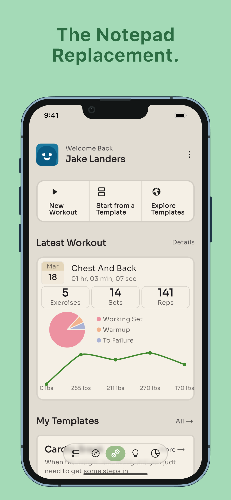 | 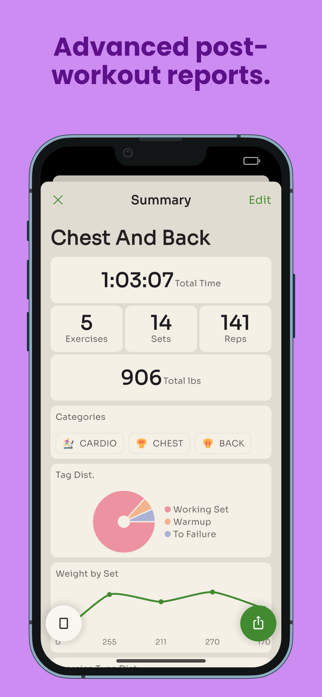 | 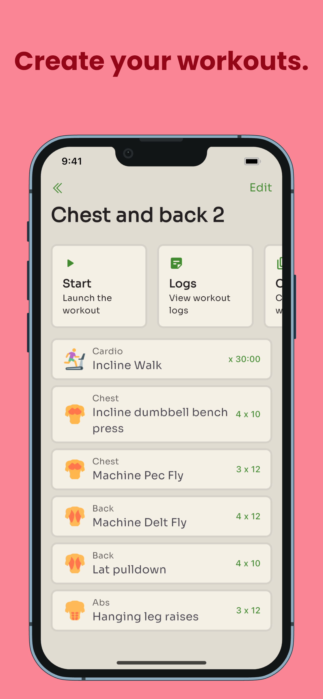 |

| Workout Edit                                                                          | Workout Launch                                                                            | Exercise Home                                                                           |
| ------------------------------------------------------------------------------------- | ----------------------------------------------------------------------------------------- | --------------------------------------------------------------------------------------- |
| 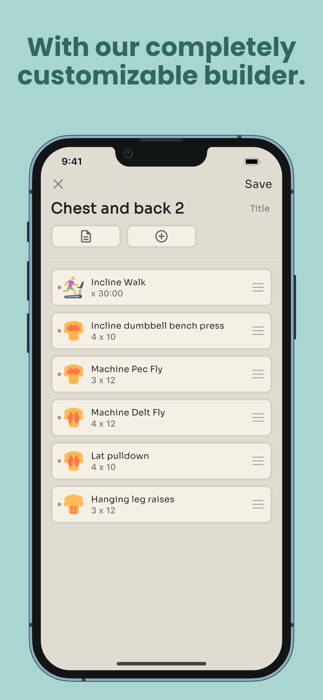 | 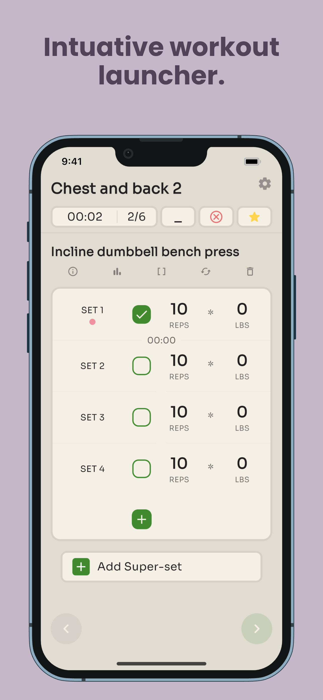 | 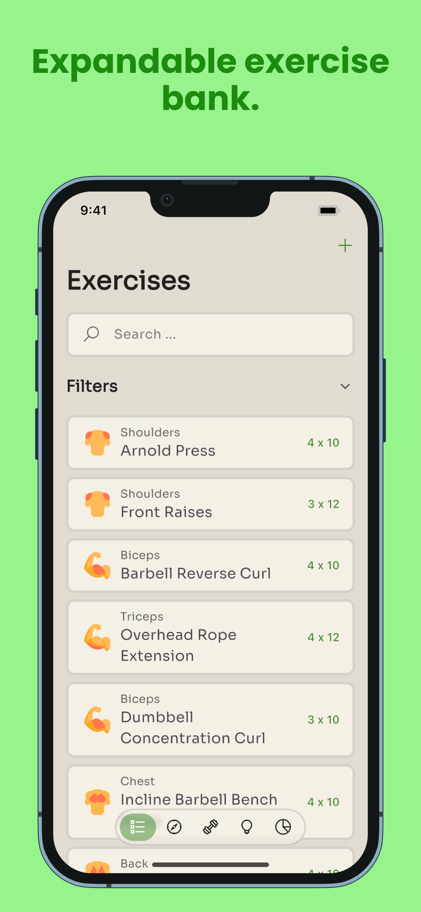 |

| Exercise Detail Cardio                                                                                    | Discover Home                                                                           | Insights Home                                                                           |
| --------------------------------------------------------------------------------------------------------- | --------------------------------------------------------------------------------------- | --------------------------------------------------------------------------------------- |
| 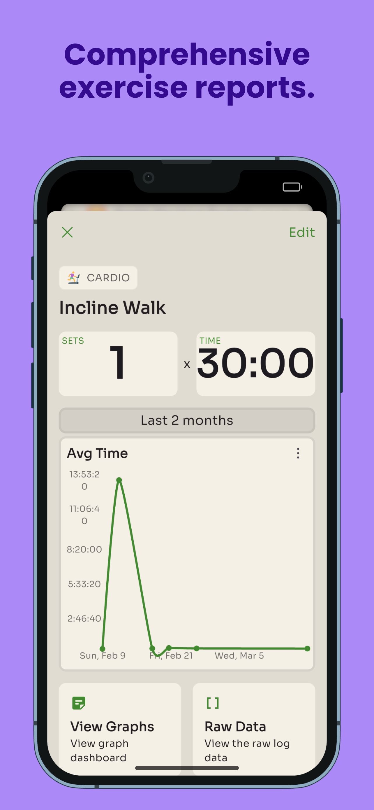 | 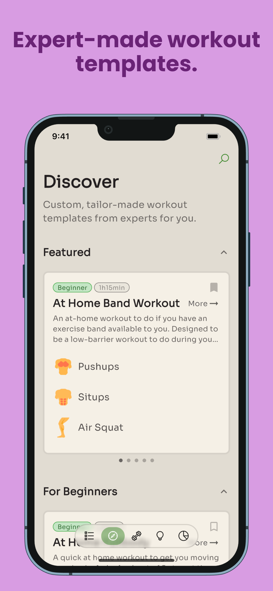 | 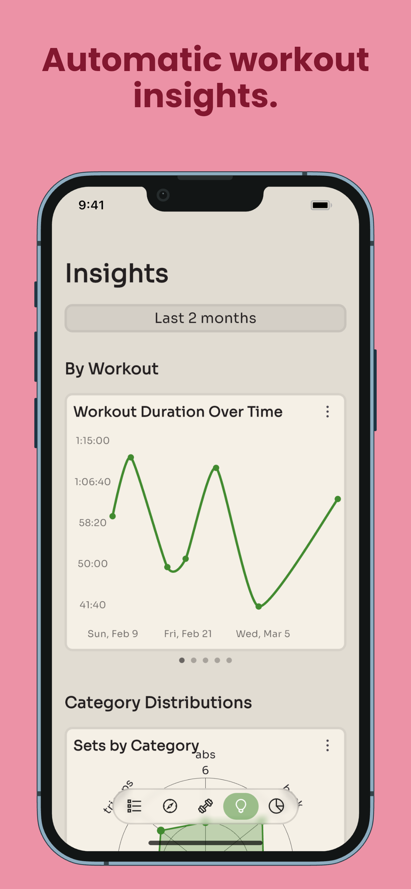 |

| Insights Home 2                                                                             | Logs Home                                                                        | Raw Workout Logs                                                                               |
| ------------------------------------------------------------------------------------------- | -------------------------------------------------------------------------------- | ---------------------------------------------------------------------------------------------- |
| 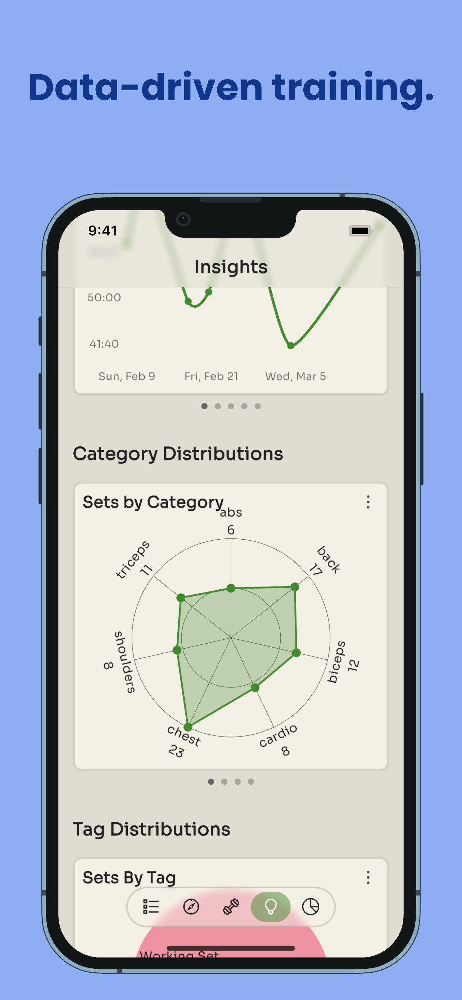 | 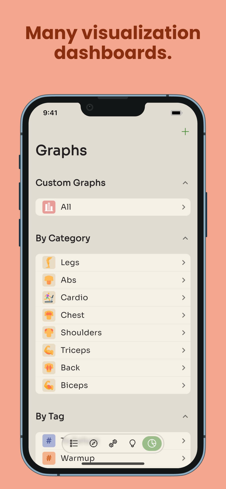 | 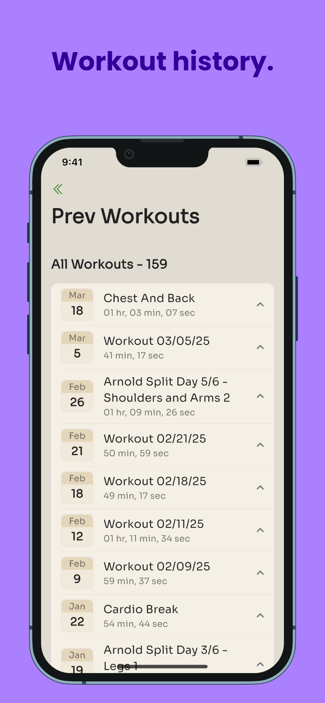 |

## About

This application is a passion project of mine, built out of the desire for a truly sandbox-esc workout planning and tracking experience. I was unsatisfied with the current offerings that were on the app store, and set out to build my own.

## Tech Stack

The application is built in [Flutter](https://flutter.dev). The application is built to be offline/local first, using an internal SQLite database.

There are two APIs, an older one written in Python which manages all of the data syncing operations, and a newer one built in Go which handles the mobile purchases and subscriptions.

> Now, the go api handles most of the logic

User authentication is handled with Google and Apple auth.

The website is built with Go + HTMX + AlpineJS.

## License

MIT
